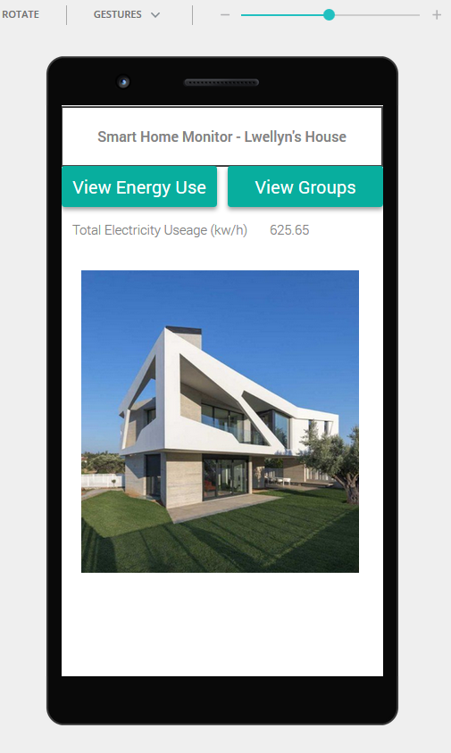

# home-energy-manager

This is an interactable high fidelity prototype of an Android based home automation app used for energy monitoring and management. It was made using the JustInMind prototyper for a UI/UX focused Human-Computer Interaction course at Seneca. Design goals were based on Jakob Nielsen's usability heuristics for UI design and Don Norman's Design Principles.

10 Usability Heuristics for User Interface Design

https://www.nngroup.com/articles/ten-usability-heuristics/

Don Norman's Design Principles

https://www.csun.edu/science/courses/671/bibliography/preece.html

## Instructions

1. Download or clone the repo
2. Open the index.html (inside the docs folder) in a web browser (Firefox or Chromium recommended)

## Screenshots

