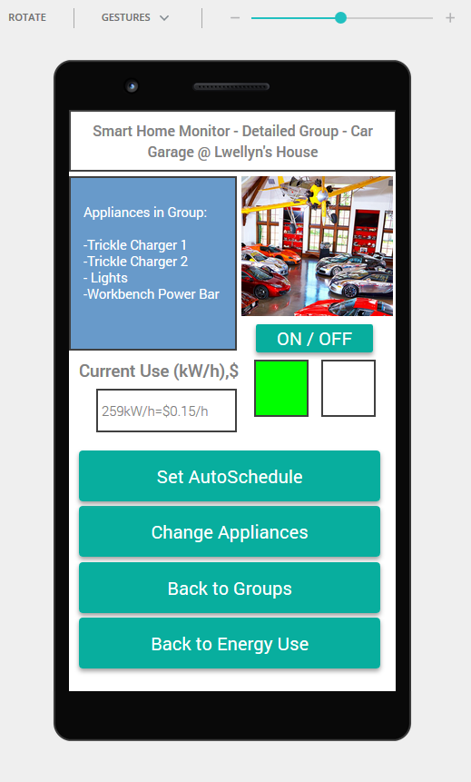

# home-energy-manager

This is an interactive high fidelity prototype of an Android based home automation app used for energy monitoring and management. It was made using the JustInMind prototyper for a UI/UX focused Human-Computer Interaction course. Use cases involved frequent travellers who might want to control appliances such as lights or pet food dispensers remotely, and tech professionals who might want to compare energy usage of different PC builds. Design goals were based on Jakob Nielsen's usability heuristics for UI design and Don Norman's Design Principles.

10 Usability Heuristics for User Interface Design

https://www.nngroup.com/articles/ten-usability-heuristics/

Don Norman's Design Principles

https://www.csun.edu/science/courses/671/bibliography/preece.html

Group Members: Tanvir Sarkar, Michael Overall, Dan Foster, Igor Krasnyanskiy

## Instructions

1. Download or clone the repo
2. Open the index.html file (inside the docs folder) in a web browser (Firefox or Chromium recommended)

## Screenshots

### Home Screen

### Energy Use Overview

### Appliance Groups Overview

### Sample Group - Living Room Lights

### Sample Group - Garage

### Setup Automation Schedule for a Group

### Change the appliances included in a group

